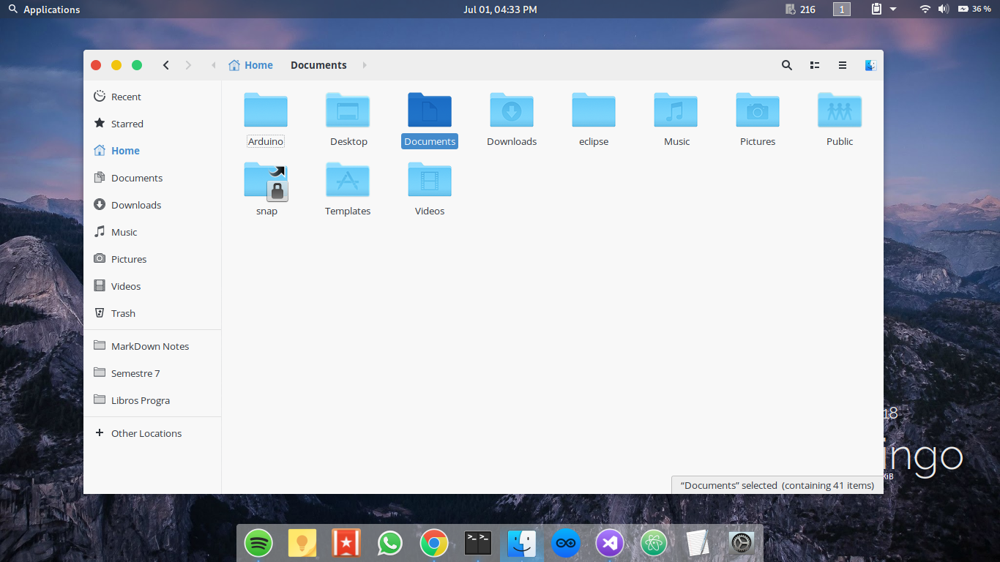

# Ant Sky



#### Installation

Extract the zip file to the themes directory i.e. `/usr/share/themes/` or `~/.themes/` (create it  if necessary).

To set the theme in Gnome, run the following commands in Terminal,

```
gsettings set org.gnome.desktop.interface gtk-theme "Ant"
gsettings set org.gnome.desktop.wm.preferences theme "Ant"
```
or Change via distribution specific tool.

### Notes:

* This theme is based on the [Ant](https://github.com/EliverLara/Ant).
* Icon theme in the screenshot is [MacOS sierra ct](https://www.opendesktop.org/p/1210856/).
* Many details still need to be polished.
* I'm starting in the world of gtk-themes and I have a lot to learn.
* **Enjoy it!**
